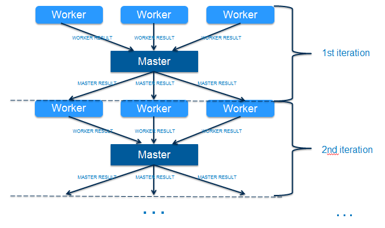

 

## Guagua

An iterative computing framework on both Hadoop MapReduce and Hadoop YARN.

## Conference

[QCON Shanghai 2014](http://2014.qconshanghai.com/node/474) [Slides](http://www.slideshare.net/pengshanzhang/guagua-an-iterative-computing-framework-on-hadoop)

## Getting Started

Please visit [Guagua site](http://shifu.ml/docs/guagua/) for tutorials.

## What is Guagua?
**Guagua**, a sub-project of Shifu, is a distributed, pluggable and scalable iterative computing framework based on Hadoop MapReduce and YARN.

This graph shows the iterative computing process for **Guagua**.

Typical use cases for **Guagua** are distributed machine learning model training based on Hadoop. By using **Guagua**, we implement distributed neural network algorithm which can reduce model training time from days to hours on 500GB data sets. Distributed neural network algorithm is based on [Encog](http://www.heatonresearch.com/encog) and **Guagua**. Any details please check our example [source code](https://github.com/ShifuML/guagua/tree/master/guagua-mapreduce-examples/src/main/java/ml/shifu/guagua/mapreduce/example/nn).

## Google Group

Please join [Guagua group](https://groups.google.com/forum/#!forum/shifu-guagua) if questions, bugs or anything else.

## Copyright and License

Copyright 2013-2014, eBay Software Foundation under the [Apache License V2.0](LICENSE.txt).
